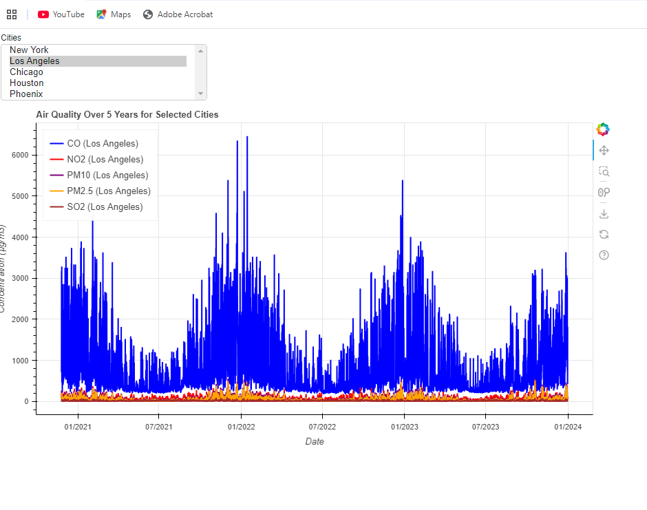
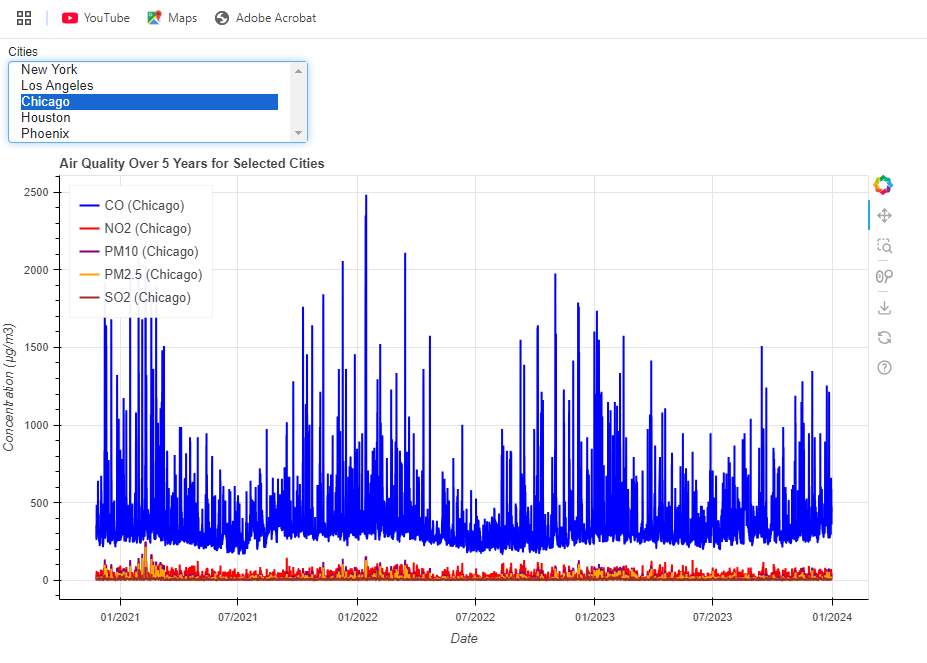
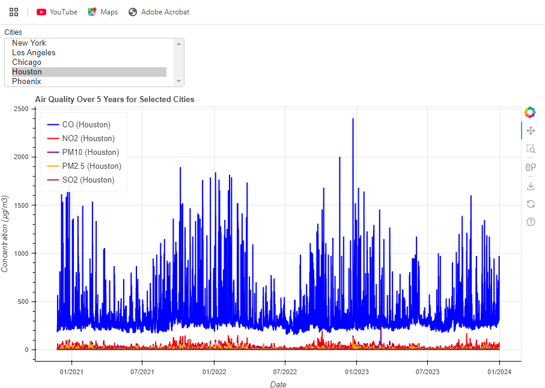
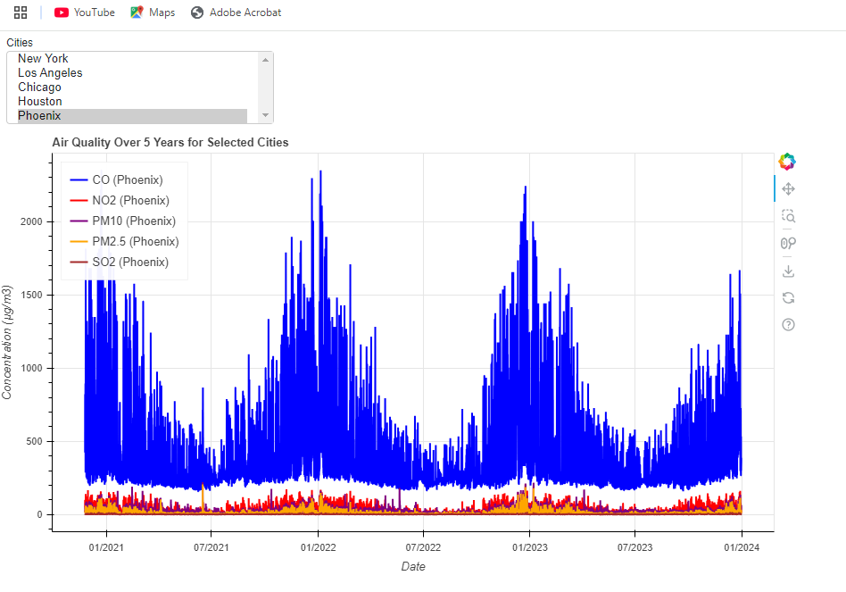
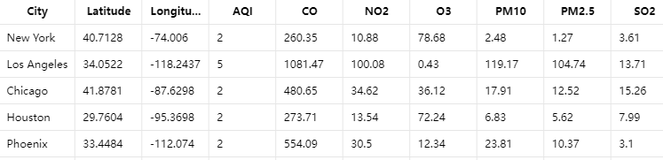
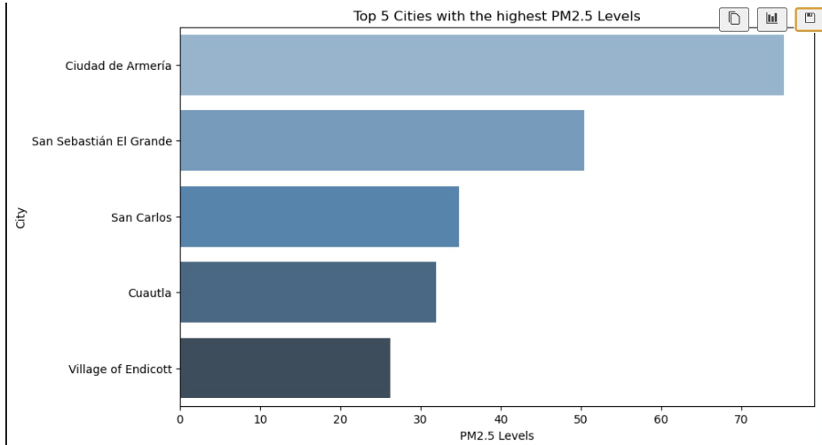
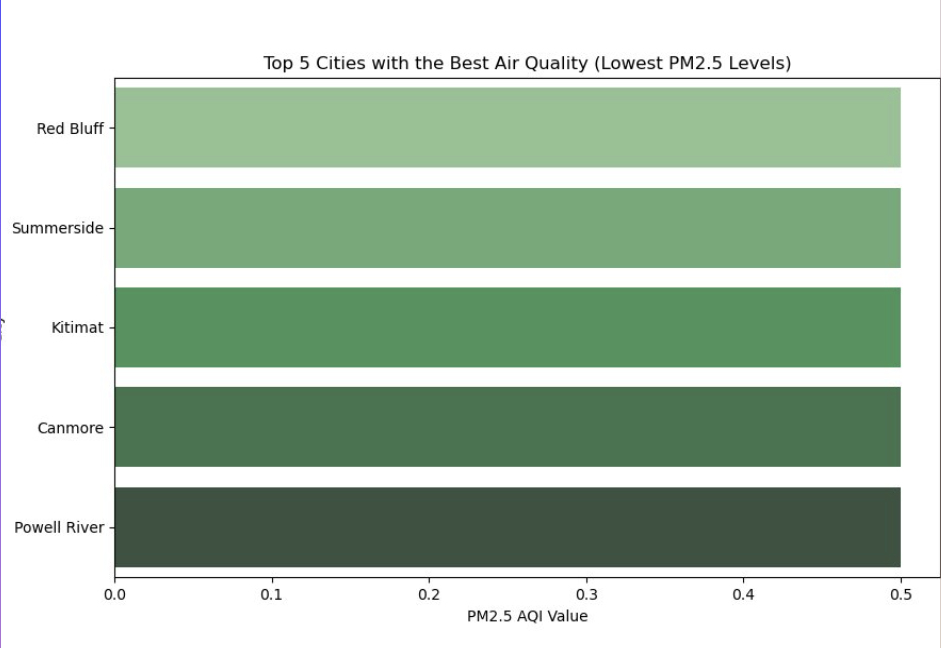
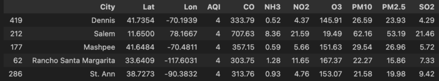
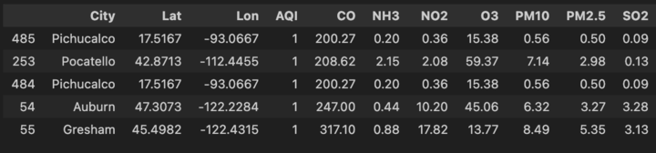
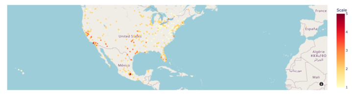

# Project_3

Air Quality Data Analysis and Visualization

# Code to find the Cordinates for City:

# Line Chart to show levels of different pollutants amont Top 5 Popular cities.

To create dashboard we imported the library name Panel. The graph is populated on the local host browser. Screen Shot attached below:

The dataset includes the following columns for each 5 city:

1. **City** :
   Name of the city.
2. **Latitude**
   and  **Longitude** : Geographical coordinates of the city.
3. **AQI
   (Air Quality Index)** : A numerical value representing overall air quality.
   The higher the AQI, the worse the air quality.
4. **CO
   (Carbon Monoxide)** : Measured in micrograms per cubic meter (µg/m³),
   this is a gas emitted from vehicles and industrial activities. High levels
   can lead to respiratory problems.
5. **NO2
   (Nitrogen Dioxide)** : A gas that contributes to smog and acid rain,
   primarily produced by vehicles and power plants. It can irritate the lungs
   and reduce immunity to lung infections.
6. **O3
   (Ozone)** : Ground-level ozone forms when pollutants emitted by cars and
   industries chemically react in sunlight. It is a major component of smog.
7. **PM10** :
   Particulate matter with a diameter of 10 micrometers or smaller, which can
   be inhaled and cause respiratory issues.
8. **PM2.5** :
   Finer particulate matter with a diameter of 2.5 micrometers or smaller.
   These particles penetrate deep into the lungs and are more harmful than
   PM10.
9. **SO2
   (Sulfur Dioxide)** : Produced by burning fossil fuels, SO2 contributes to
   acid rain and respiratory problems.

Key findings from the above chart - Los Angeles had the highest spike in CO level in the year 2022 above 6000 and New York has its highest spike in Year 2024 of above 5000 resulting high AQI value resulting in most polluted cities

Based on most recent data collected from open weather API for a day:

Analysis for the above data:

* **Most Polluted City: Los Angeles**
  * **AQI** :
    5 (The highest among the cities, indicating the worst air quality)
  * **CO** :
    1081.47 µg/m³ (Highest among all cities)
  * **NO2** :
    100.08 µg/m³ (Significantly higher than others)
  * **PM2.5** :
    104.74 µg/m³ (Extremely high, posing serious health risks)
  * **SO2** :
    13.71 µg/m³ (Higher than most cities)

Los Angeles suffers from high levels of various pollutants,
especially particulate matter (PM2.5) and CO, making it the most polluted city
in this dataset.

* **Least
  Polluted Cities: New York, Houston, Chicago, and Phoenix with AQI index of 2.**

# Create heatmap based on AQI value by importing Folium Lib. Screen Shot below:

The dataset contains columns such as City, Latitude and Longitude, AQI.

Cities with the Worst AQI (4):

1. Chicago
2. New York City
3. Saint Paul

These cities have the highest AQI values, indicating the worst air quality, which could have a significant impact on the health of their populations.

Cities with the Best AQI (1):

Few examples of cities with Best AQI(1):

1. Pittsburg
2. Buffalo
3. Ohio

These cities enjoy clean air and minimal pollution risks.

**Top 5 Cities with the **highest PM2.5 Levels****

Key Findings:

* ** PM2.5 refers to fine particles 2.5 micrometers or **smaller that can penetrate the lungs and cause **health risks.**
* ** The bar chart shows the top 5 cities with the **highest PM2.5 levels, indicating severe air **pollution.**
* **Most of these cities are in Mexico, highlighting **significant pollution issues in the region.

**Top 5 Cities with the lowest PM2.5 Levels**

Key Findings:

* **The cities shown in this visualization are **located in The United States and Canada, **with all of them exhibiting low PM2.5 **levels, indicating excellent air quality.
* ** Canada, in particular, has several cities **with very clean air, likely due to lower **levels of industrial pollution and a focus on **environmental sustainability.

**Top 5 Cities with **the highest/lowest AQI Levels**

**The Air Quality Index (AQI) reflects **the combined impact of multiple **pollutants, and cities with higher levels **of pollutants like PM2.5, PM10, NO2, **and CO typically have higher AQI **values.

**Real-Time Air Quality Map for AQI **as of Oct 20, 2024**

* AQI was primarily bad across the USA with a Value higher than 3-5
* **Mexico and Canada showed to **have good Air Quality ranging from 1-2

Ozone is formed in the atmosphere through chemical reactions between

Pollutants emitted into the air

* **Oct 20, showed a high **concentration of O3 across most **of USA**
* **Mexico showed a lower **concentration

