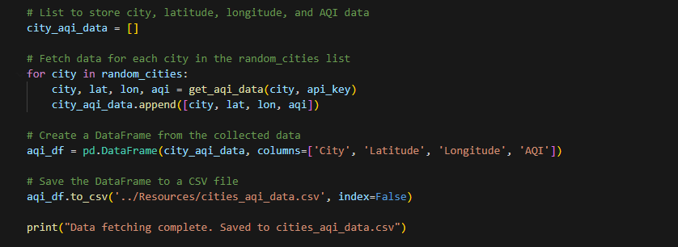

# Project_3
Air Quality Data Analysis and Visualization
Air Quality Data Analysis and Visualization

Code to find the Cordinates for City:

Imported the lib Panel to create Dashboard for Top5 popular cities. The graph is populated on the local host browser. Screen Shot attached below:

Code to pull the lat, long, AQI from API for cities stored in Cities_list. Create new csv name cities_aqi_data.csv to store the new data frame:

Create heatmap based on AQI value by importing Folium Lib. Screen Shot below:

